# Experiments documentation

This document describes the steps took in the preparation of the data, training
and final selection of the model this repository holds.

## Dataset technical descriptions

[The Oxford-IIIT Pet Dataset](https://www.robots.ox.ac.uk/~vgg/data/pets/)
presents with more than 7,000 images divided across 37 different breeds
of the domestic cats and dogs existent today.

|  |
| :-: |
| *Dataset statistics.* |

The dataset is available with the following directory structure:

| 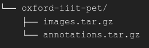 |
| :-: |
| *Depiction of the Oxford-IIIT pet dataset directory structure.* |

where the `annotations.tar.gz` contains various metadata information regarding
the cats and dogs analyzed in their research paper, including a text file called
`list.txt` in which all the images labels are listed in a tabular format.
Meanwhile the `images.tar.gz` file contains the corpora of images that will be
the focus from here forward.

The `images.tar.gz` folder looks like this:

| 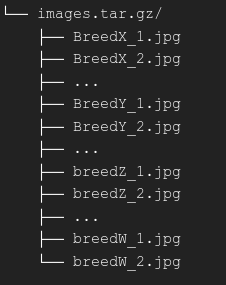 |
| :-: |
| *Depiction of the Oxford-IIIT Pet images directory structure.* |

Each file inside the `images.tar.gz` belongs to a sample of each breed
described earlier, with the exception of three `.mat` files that appears to be
there human error and will be ignored.

Notice how the images are labeled. They represent the images that belongs to
cats using the uppercase letter of the breed itself and the lowercase letter
for dogs. After the breed name in this format an autoincrement identifier is
appended.

For the experimentations made on the final chosen model architecture, and for
further empathize the versatility of the model, data from 2 extra cat breeds
were introduced. More breeds can be appended the same way.
The [American Shorthair](https://www.purina.com/cats/cat-breeds/american-shorthair)
and [Turkish Van](https://www.hillspet.com/cat-care/cat-breeds/turkish-van)
images were manually selected from these sites and visually discriminated by
the author given their characteristics:

* [Google Images](https://images.google.com/)
* [flickr](https://www.flickr.com/)
* [petfinder](https://www.petfinder.com/)
* [Reddit](https://www.reddit.com/)
* Any necessary conversion to JPG was done with [ezgif](https://ezgif.com/).

### Images distribution

The images will be organized in such a way that satisfies the
[`ImageFolder` and `DataLoader`](https://pytorch.org/vision/stable/generated/torchvision.datasets.ImageFolder.html)
classes of PyTorch.

In order to achieve this the first step was to extract all different breeds on
the main directory and store them on a dictionary as keys, relating themselves
to an empty list.

| 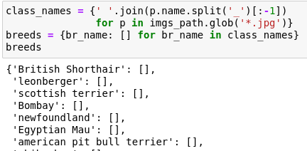 |
| :-: |
| *Example of the dictionary of breeds.* |

Each key's value will represent a list of all the images found with the
associated breed name.

| 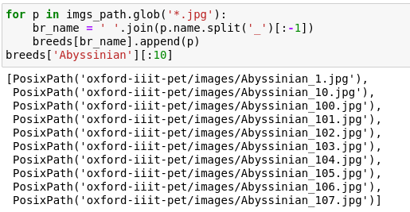 |
| :-: |
| *Sample list of a specific breed in the dictionary.* |

Finally all images in the variable will be distributed in the format previously
described. This will produce a directory structure similar to this:

| 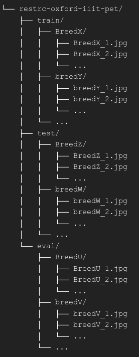 |
| :-: |
| *Depiction of the proposed images directory structure.* |

The `train`, `test` and `eval` subdirectories shown above represent the three
main splits in which the data is divided. Each experiment is to be trained and
evaluated before the final test with the selected model. More information
regarding this approach [here](https://www.v7labs.com/blog/train-validation-test-set).

The splits in the experiments that will be described shortly were of:

* 50 images for training
* 50 images for evaluation
* 100 (or the rest in the case of unbalanced classes) images for testing

These sizes were chosen due to the sizes used on the original Oxford-IIIT pet
dataset paper and the small amount of observations that were collected. Despite
this, and it will be shown, the model seems to learn considerably well and quick
from the passed datasets.

## Initial experiments

In this section the goal was to prove how well the data trained on two different
pre-trained models.

Reference on "pre-trained" models:

* [PyTorch's Models and pre-trained weights](https://pytorch.org/vision/stable/models)
* [TensorFlow's transfer learning documentation](https://www.tensorflow.org/tutorials/images/transfer_learning)

### Vision transformer

[`vit_b_16`](https://pytorch.org/vision/stable/models/generated/torchvision.models.vit_b_16.html),
which represent PyTorch's implementation of the Vision Transformer first
introduced in the [An Image is Worth 16x16 Words: Transformers for Image Recognition at Scale](https://arxiv.org/abs/2010.11929)
paper. This model utilizes the ["transformer"](https://jalammar.github.io/illustrated-transformer/)
and ["attention"](https://jalammar.github.io/visualizing-neural-machine-translation-mechanics-of-seq2seq-models-with-attention/)
algorithms used in [Natural Language Processing (NLP)](https://www.ibm.com/topics/natural-language-processing)
for training. In a nutshell each image passed is segmented into multiple patches
of linearly embeddings, which the model with focus on given how much "attention"
it gives to specific patches.

In theory this method should work as the animals in each image can have
backgrounds that doesn't add too much information to the prediction so
"focusing" on certain parts, like the head (just like what the
[original research paper]((https://www.robots.ox.ac.uk/~vgg/publications/2012/parkhi12a/parkhi12a.pdf))
does in one of its layers), should make the model learn faster than other
models.

Although powerful it is also very big, with an approximate amount of 86.6M
parameters and a file size of approximately 300 MBs.

This model was trained with the following characteristics:

* `batch_size`: `64`
* `lr`: `0.001`
* `betas`: `(0.9, 0.999)`
* `weight_decay`: `0.1`
* `epochs`: `5`

| 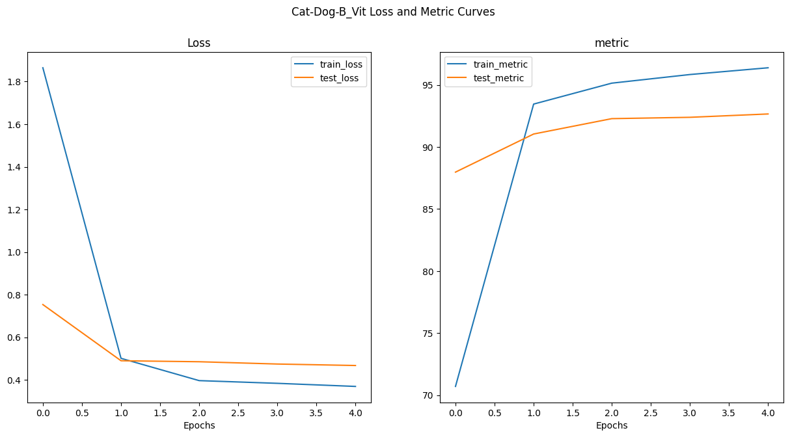 |
| :-: |
| *Loss and metric curves of the initial ViT training section.* |

### EfficientNet_B2

[`efficientnet_b2`](https://pytorch.org/vision/stable/models/generated/torchvision.models.efficientnet_b2.html),
which represent PyTorch's implementation of the EfficientNet_B2
introduced in the [EfficientNet: Rethinking Model Scaling for Convolutional Neural Networks](https://arxiv.org/abs/1905.11946)
paper. This model manages to beat great performing [Convolutional Neural Networks](https://poloclub.github.io/cnn-explainer/)
existing on the time of research at the time.

With the small size of approximately 7.8M parameters and file size of about
30 MBs, it is one of the best and lightest pre-trained models in the
`torchvision` catalog. The use of their "compound scaling" in their CNN makes
this an appropriate algorithm for identifying underlying patterns in the images
that we are dealing with.

This model was trained with the following characteristics:

* `batch_size`: `64`
* `lr`: `0.001`
* `epochs`: `5`

| 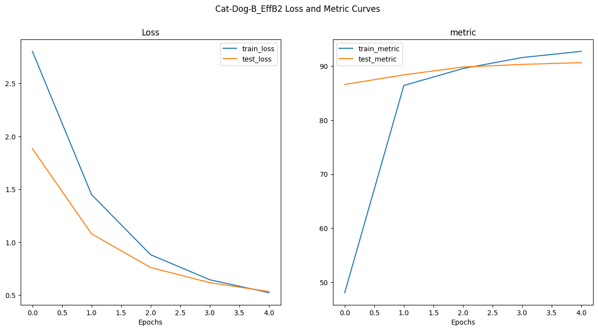 |
| :-: |
| *Loss and metric curves of the initial EfficientNetB2 training section.* |

### Initial experiments conclusion

Both models show [overfitting](https://elitedatascience.com/overfitting-in-machine-learning),
but the EfficientNet_B2 is presented as the most compelling one for its size
and less trackable overfitting.

To solve this issue applying more transformations and augmentations, alongside
with data regularization is advised. For this project the following methods
were used in the subsequent experimentations:

* [Random Rotation](https://pytorch.org/vision/stable/generated/torchvision.transforms.RandomRotation.html).
Transformation technique chosen with the hope of giving the model more angles
from which can identify the animals in the dataset.
* [Trivial Augmentation](https://pytorch.org/vision/master/generated/torchvision.transforms.TrivialAugmentWide.html).
Transformation and augmentation technique chosen for its power of given more
variance to the data beyond just rotating the images.
* Reduced [Learning Rate](https://machinelearningmastery.com/understand-the-dynamics-of-learning-rate-on-deep-learning-neural-networks/).
To decay the amount of overfitting during each training epoch.
* Introducing [weight decay](https://medium.com/analytics-vidhya/deep-learning-basics-weight-decay-3c68eb4344e9)
to the model. For regularizing the data further by slightly increasing the loss
values.

## Further experimentations

This section will describe the results of running the EfficientNet_B2 model
through training sections with various hyperparameters and other regularization
techniques applied. In addition to this the two extra breeds described earlier
were used.

| 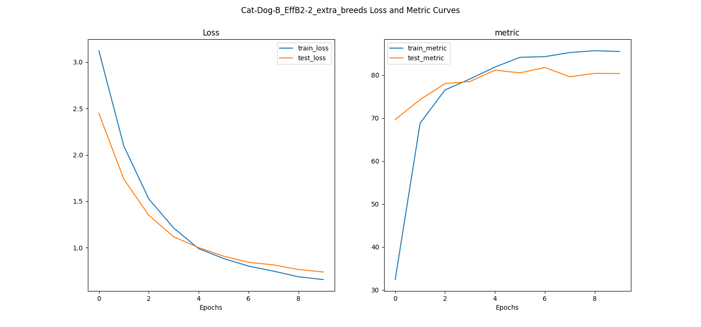 |
| :-: |
| *Loss and metric curves of the EfficientNetB2 with extra breeds training section.* |

| 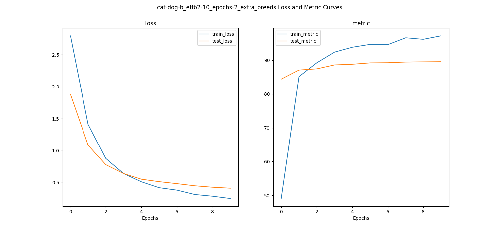 |
| :-: |
| *Loss and metric curves of the EfficientNetB2 with extra breeds and a 10 epoch training section.* |

| 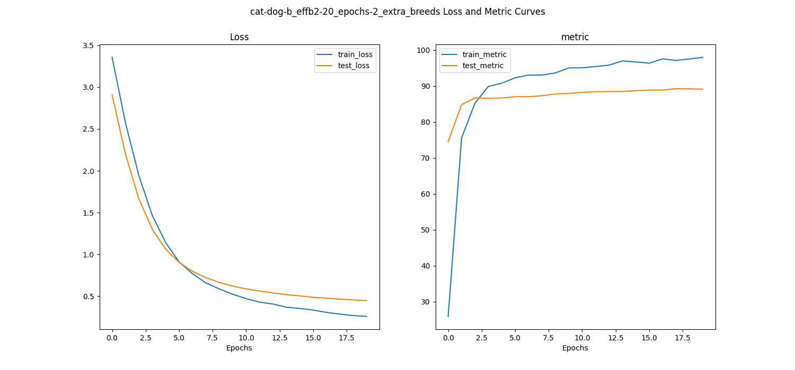 |
| :-: |
| *Loss and metric curves of the EfficientNetB2 with extra breeds and a 20 epoch training section.* |

| 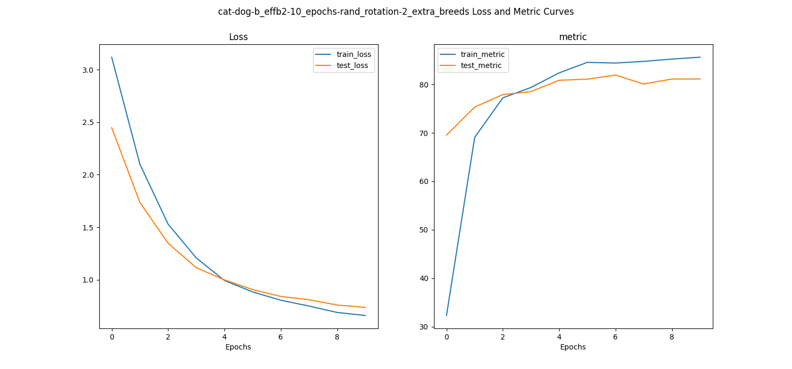 |
| :-: |
| *Loss and metric curves of the EfficientNetB2 with extra breeds, random rotation from 0 to 180 degrees and a 10 epoch training section.* |

| 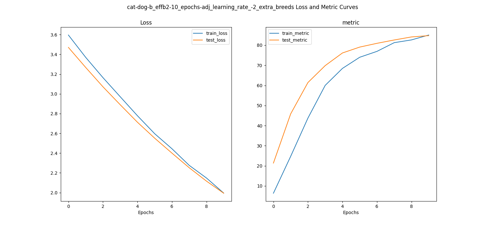 |
| :-: |
| *Loss and metric curves of the EfficientNetB2 with extra breeds, an adjusted learning rate of `0.0001` and a 10 epoch training section.* |

| 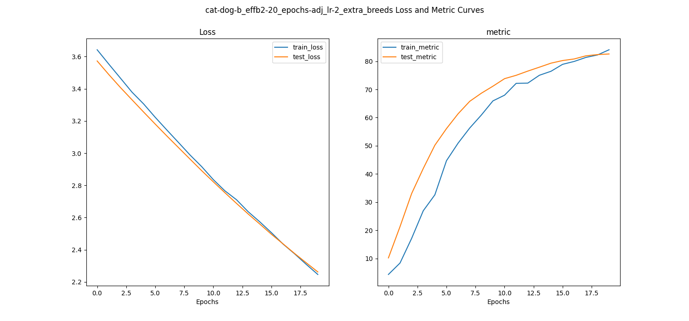 |
| :-: |
| *Loss and metric curves of the EfficientNetB2 with extra breeds, an adjusted learning rate of `0.0001` and a 20 epoch training section.* |

| 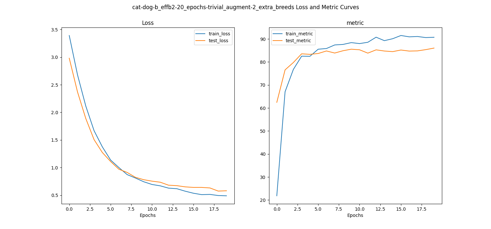 |
| :-: |
| *Loss and metric curves of the EfficientNetB2 with extra breeds, an trivial augmentation with `num_magnitude_bins = 10` and a 20 epoch training section.* |

| 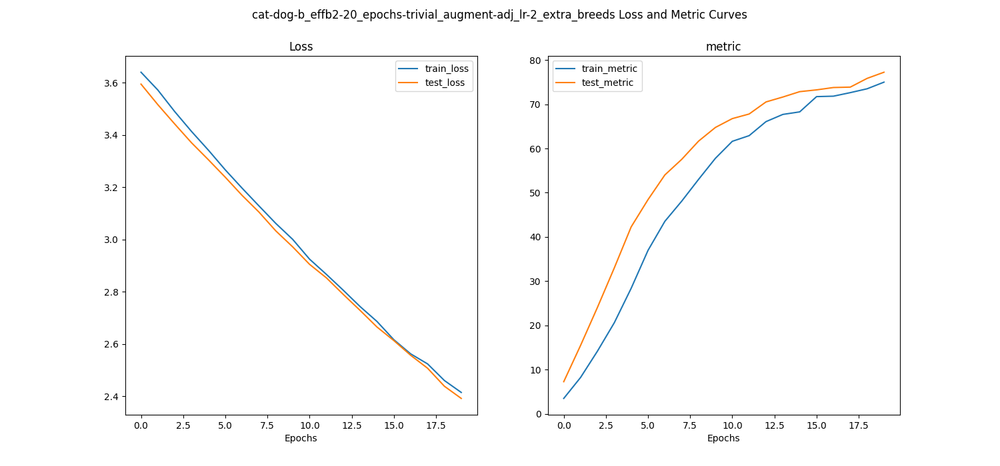 |
| :-: |
| *Loss and metric curves of the EfficientNetB2 with extra breeds, an trivial augmentation with `num_magnitude_bins = 10`, an adjusted learning rate of `0.0001` and a 20 epoch training section.* |

| 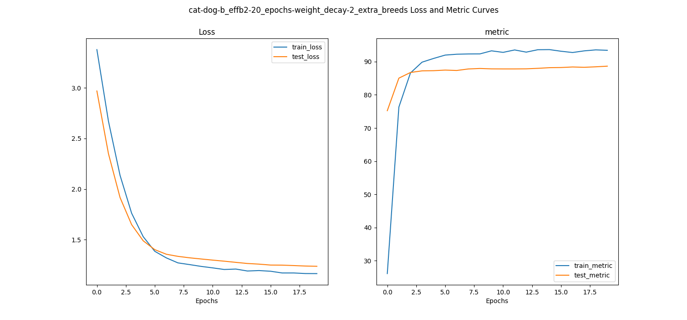 |
| :-: |
| *Loss and metric curves of the EfficientNetB2 with extra breeds, added `weight_decay = 0.1` and a 20 epoch training section.* |

### Final chosen model

The EfficientNetB2 model with extra breeds, an trivial augmentation with
`num_magnitude_bins = 10`, an adjusted learning rate of `0.0001` and a 20 epoch
training section proves to be the more promising.
