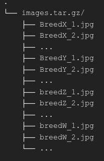

# Experiments

This document describes the steps took in the preparation of the data, training
and final selection of the model this repository holds.

## Dataset technical descriptions

[The Oxford-IIIT Pet Dataset](https://www.robots.ox.ac.uk/~vgg/data/pets/)
presents with more than 7,000 images divided across 37 different breeds
of the domestic cats and dogs existent today.

|  |
| :-: |
| *Dataset statistics.* |

The dataset is available with the following directory structure:

|  |
| :-: |
| *Depiction of the Oxford-IIIT pet dataset directory structure.* |

where the `annotations.tar.gz` contains various metadata information regarding
the cats and dogs analyzed in their research paper, including a text file called
`list.txt` in which all the images labels are listed in a tabular format.
Meanwhile the `images.tar.gz` file contains the corpora of images that will be
the focus from here forward.

The `images.tar.gz` folder looks like this:

|  |
| :-: |
| *Depiction of the Oxford-IIIT Pet images directory structure.* |

Each file inside the `images.tar.gz` belongs to a sample of each breed
described earlier, with the exception of three `.mat` files that appears to be
there human error and will be ignored.

Notice how the images are labeled. They represent the images that belongs to
cats using the uppercase letter of the breed itself and the lowercase letter
for dogs. After the breed name in this format an autoincrement identifier is
appended.

### Images distribution

The images will be organized in such a way that satisfies the
[`ImageFolder` and `DataLoader`](https://pytorch.org/vision/stable/generated/torchvision.datasets.ImageFolder.html)
classes of PyTorch.

In order to achieve this the first step was to extract all different breeds on
the main directory and store them on a dictionary as keys, relating themselves
to an empty list.

|  |
| :-: |
| *Example of the dictionary of breeds.* |

Each key's value will represent a list of all the images found with the
associated breed name.

|  |
| :-: |
| *Sample list of a specific breed in the dictionary.* |

Finally all images in the variable will be distributed in the format previously
described. This will produce a directory structure similar to this:

|  |
| :-: |
| *Depiction of the proposed images directory structure.* |
